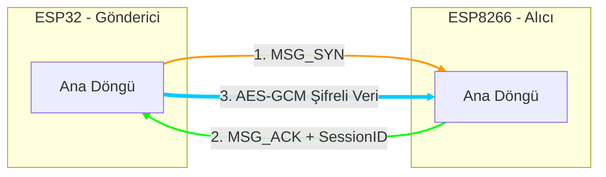
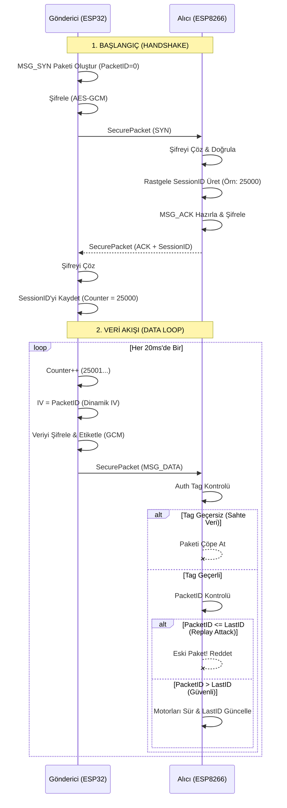

#  ESP-NOW AES-GCM

### *AES-128-GCM Şifrelenmiş İletişim*

  
Bu proje, **ESP32 (Gönderici)** ve **ESP8266 (Alıcı)** mikrodenetleyicileri arasında askeri sınıf **AES-128-GCM** şifrelemesi kullanarak, düşük gecikmeli ve güvenli bir uzaktan kontrol sistemi uygular.

Standart ESP-NOW uygulamalarının aksine; bu sistem verinin sadece gizliliğini değil, **kimlik doğrulamasını (Authentication)** ve **bütünlüğünü (Integrity)** de garanti eder. Ayrıca, dinamik oturum yönetimi sayesinde **Replay Attack (Tekrar Saldırısı)** girişimlerini engeller.
  

---


##  Sistem Mimarisi

  




---
  

##  Temel Özellikler

•  **AES-128-GCM Şifreleme:** Veriler sadece şifrelenmekle kalmaz, GCM modu sayesinde her paketin doğruluğu `Auth Tag` ile kontrol edilir.

•  **Güvenli Handshake (El Sıkışma):** Sistem başlamadan önce `SYN` -> `ACK` protokolü ile taraflar anahtar değişimi yapmadan oturum kurar.

•   **Replay Attack Koruması:** Her oturum için rastgele üretilen ve senkronize edilen `Session Counter` sayesinde, saldırganların kaydettiği eski sinyaller (örneğin "kapıyı aç" komutu) alıcı tarafından reddedilir.

•  **Otomatik Desync Recovery:** Verici ve alıcı arasındaki sayaç senkronizasyonu bozulursa, alıcı otomatik olarak `MSG_RST` paketi göndererek güvenli bağlantıyı sıfırlar.

• **Hibrit Kütüphane Yapısı:**

◦ **ESP32:** Donanım hızlandırıcılı `mbedtls` kütüphanesi.

◦ **ESP8266:** Hafif sıklet `bearssl` kütüphanesi.
  
---

  

## Kurulum ve Yapılandırma

Bu sistem noktadan-noktaya (Peer-to-Peer) çalıştığı için cihazların birbirinin MAC adresini bilmesi **zorunludur**. Lütfen aşağıdaki adımları sırasıyla uygulayın.

### Adım 1: MAC Adreslerini Öğrenme

Her iki kartın benzersiz donanım kimliğini (MAC Adresi) öğrenmek için projede bulunan yardımcı aracı kullanın.

1. `HardwareIdentity.ino` kodunu ESP32 ve ESP8266 kartlarınıza sırasıyla yükleyin.

2. Seri Monitörü (115200 baud) açın.

3. Ekranda beliren `C-Array Format` çıktısını kopyalayın.

◦ _Örnek Çıktı:_  `{ 0xA8, 0x42, 0xE3, 0x83, 0x76, 0x7C }`

### Adım 2: Göndericiyi (ESP32) Ayarlama

`ESP32_Sender_GCM.ino` dosyasını açın ve şu satırları düzenleyin:

```
// [12] Alıcının (ESP8266) MAC adresini buraya yapıştırın
const uint8_t RECEIVER_MAC[] = {0xFF, 0xFF, 0xFF, 0xFF, 0xFF, 0xFF}; 

// [12] 16 Byte (128-bit) gizli anahtarınızı belirleyin
const uint8_t AES_KEY[13] = { 
    0x2B, 0x7E, 0x15, 0x16, 0x28, 0xAE, 0xD2, 0xA6,
    0xAB, 0xF7, 0x15, 0x88, 0x09, 0xCF, 0x4F, 0x3C
};

```

### Adım 3: Alıcıyı (ESP8266) Ayarlama

`ESP8266_Receiver_GCM.ino` dosyasını açın ve şu satırları düzenleyin:

```
// [14] Göndericinin (ESP32) MAC adresini buraya yapıştırın
uint8_t SENDER_MAC[] = {0xFF, 0xFF, 0xFF, 0xFF, 0xFF, 0xFF};

// [14] Gönderici ile AYNI anahtarı kullanmalısınız!
const uint8_t AES_KEY[13] = { ... }; 

```

⚠️ **UYARI:**  `AES_KEY` her iki cihazda da birebir aynı olmalıdır, aksi takdirde `Auth Failed` hatası alırsınız.

--------------------------------------------------------------------------------

  
## Güvenlik Mimarisi

Sistem, NIST standartlarına uygun GCM (Galois/Counter Mode) yapısını kullanır.

Veri Paketi Yapısı (SecurePacket)

Veriler havada şu yapıda dolaşır:

```c
typedef struct __attribute__((packed)) {
  uint8_t iv[17];        // Initialization Vector (Her pakette değişir)
  uint8_t tag[13];       // Authentication Tag (Bütünlük doğrulaması)
  uint8_t ciphertext[];  // Şifrelenmiş Payload
} SecurePacket;

```

#### Çalışma Mantığı

1. **IV Oluşturma:** Her paket gönderiminde `IV` (Başlangıç Vektörü), `PacketID` kullanılarak dinamik oluşturulur. Asla aynı IV iki kez kullanılmaz.

2. **Şifreleme & Etiketleme:** ESP32, `mbedtls_gcm_crypt_and_tag` fonksiyonu ile veriyi şifreler ve bir doğrulama etiketi (Tag) üretir.

3. **Doğrulama & Şifre Çözme:** ESP8266, gelen paketin etiketini `br_gcm_get_tag` ile hesaplar. Eğer etiket eşleşmezse paket sahte kabul edilir ve sessizce atılır.
  

---

## Durum LED'leri ve Debug

Seri Monitör üzerinden sistemin durumunu takip edebilirsiniz:

• `[Info] SYN Received. Handshake Start.` -> Bağlantı isteği alındı.

• `[Security] Auth Failed! Invalid Tag.` -> Yanlış anahtar veya bozuk veri.

• `[Security] Replay Attack Detected` -> Saldırgan eski bir paketi tekrar yolladı.

• `[Info] Connected! Synced Session ID:` -> Bağlantı başarılı ve güvenli.

--------------------------------------------------------------------------------

## Lisans

  

MIT License
